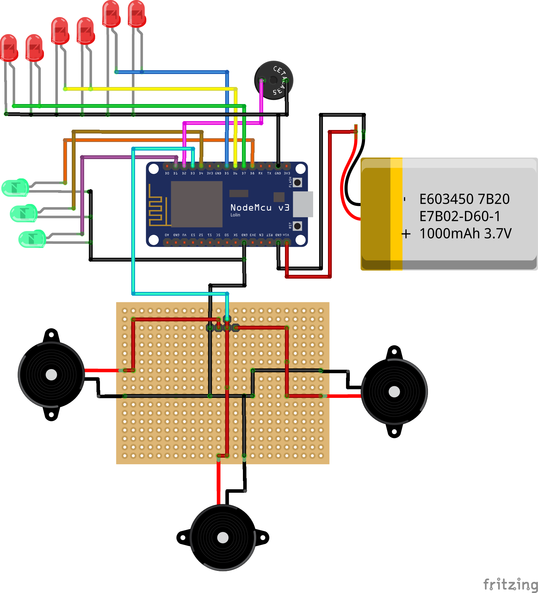

# EspruinoProjects
Some examples and projects using Espruino

# Flashing

Send scritp will put all javascripts from the folder, passed as argument,
together and will send to your dev board. 

For "flash" it to your ESP8266 run:

## Linux

```sh
./send.sh /dev/ttyUSB0 blink/
```

## Windows

```ps1
.\send.ps1 com4 .\blink\
```

# Projects

## Blink

Simple blink on D2 onboard LED, it is actually a sanity test of the environment
and the send script.

## Jingle Bells - IoT Carpet

Let's make an IoT carpet that when stepped on it will play Jingle Bells, light
on leds in the Santa Clauss and his Reindeers eyes and noses, plus notify that
there is someone at the door, like a high-tech IoT door bell!

- Warnings
  - wifi.js
    - Do not forget to enter your wifi credentials, I left it blank to you
    - In steppedHere function if you have some service to notify you put the
    address in http call



## Netflix Christmas IoT Socks

My Christmas socks have LEDs that blink in response to the movement of my legs,
and if I shake my leg hard the sock will pause what I'm watching on TV.
Another feature, which is the main functionality of the original Netflix sock,
is that after the sock doesn't detect activity on my legs for a long time, the
socks systems will turns off the TV.

- Warnings
  - wifi.js
    - Do not forget to enter your wifi credentials, I left it blank to you
  - index.js
    - Do not forget to enter the TV IP address on:
    ```js
    var tv = new PhilipsTV("192.168.0.105");
    ```


